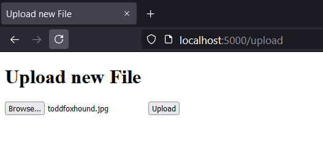
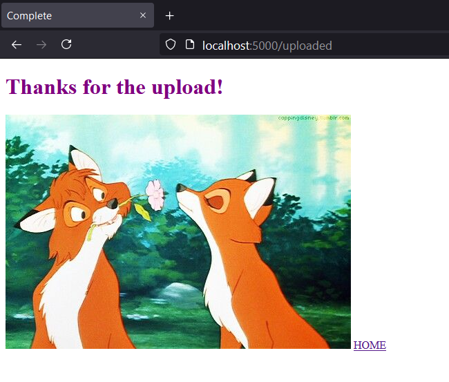
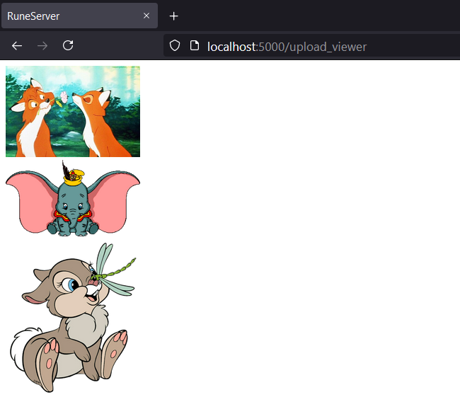

# Rune-Server

<b>
A simple File Server using Flask.

</b>

Features:
- Upload and and serve any file on a local network
- Unlimited file sizes

<h4>SETUP:<h4>
  local test:
  flask run --host=localhost
  network test:
  flask run --host=192.168.0.*  (the interface you want to use)

