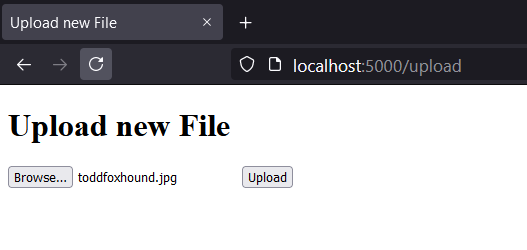
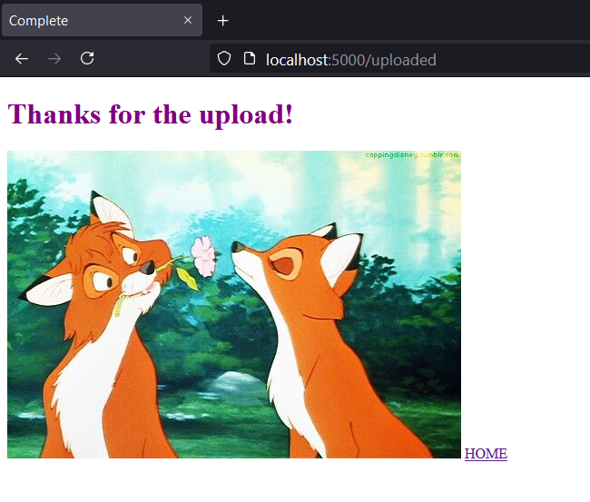
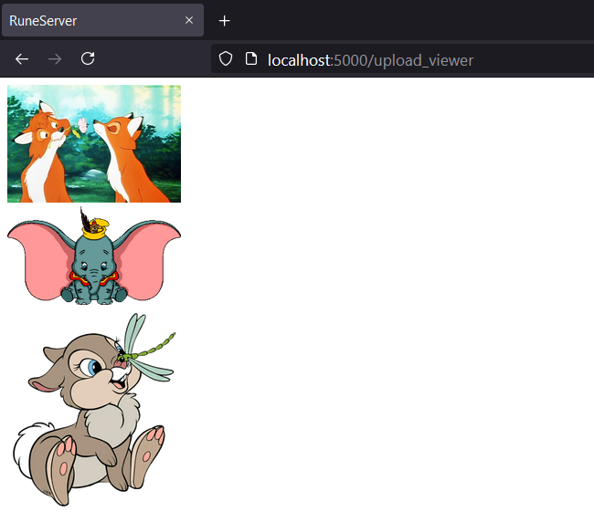

# Rune-Server

<b>
A simple File Server using Flask.

</b>

Features:
- Upload and and serve any file on a local network
- Unlimited file sizes

<h4>SETUP:<h4>
app.py is the default flask entry point, so we just need
to run for local testing: flask run --host=localhost

